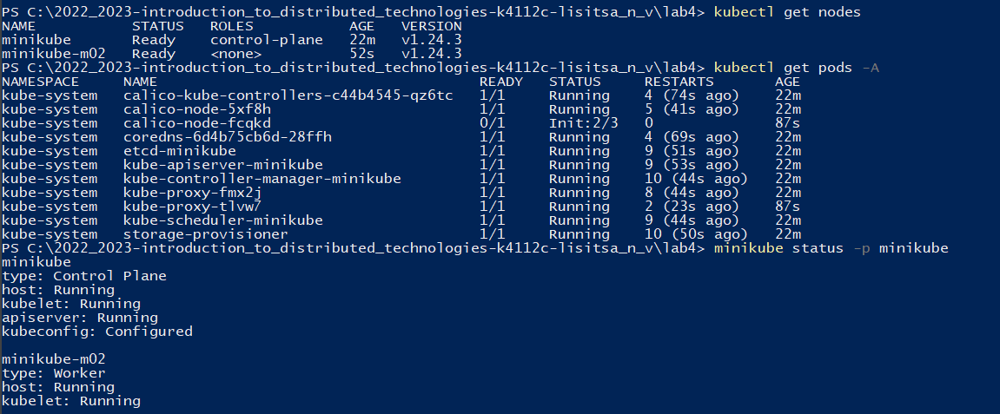
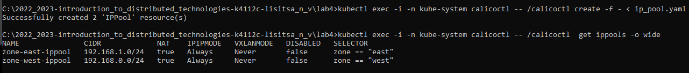
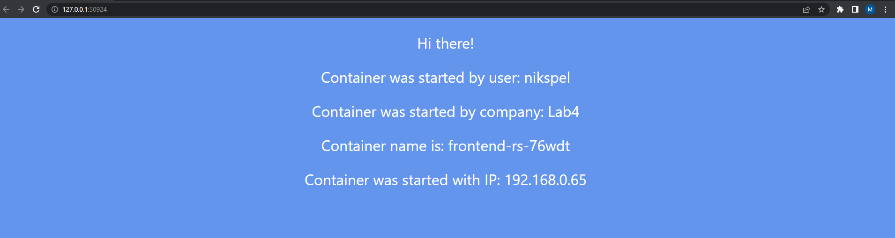
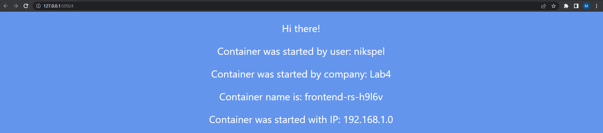
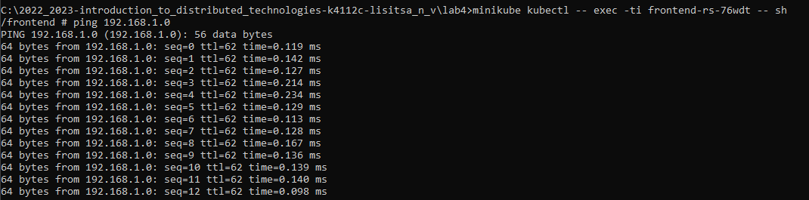
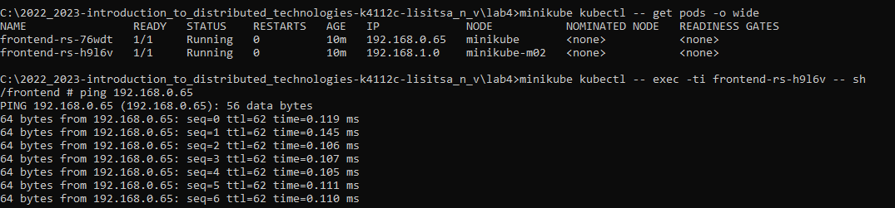
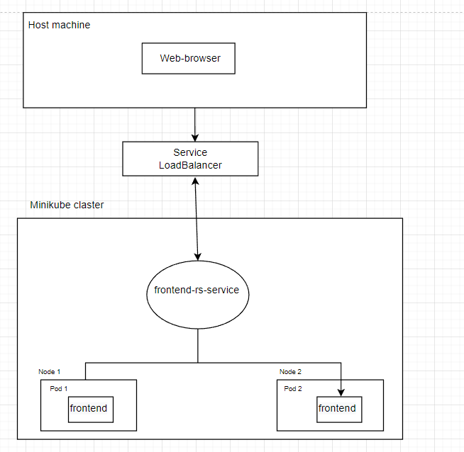

University: [ITMO University](https://itmo.ru/ru/)    
Faculty: [FICT](https://fict.itmo.ru)    
Course: [Introduction to distributed technologies](https://github.com/itmo-ict-faculty/introduction-to-distributed-technologies)    
Year: 2022/2023    
Group: K4112c    
Author: Lisitsa Nikita Vyacheslavovich  
Lab: Lab4 
Date of create: 
Date of finished: 
___
## Создание кластера minikube
После установки плагина "calico", разворачиваем 2 ноды следующей командой:
```bash
minikube start --nodes 2 --cni calico --kubernetes-version=v1.24.3
```
Проверяем количество созданных нод:


Деплою манифест для создания calico пода, слудющей командой:

___
## Создание IP-пулов и всех необходимых компонентов
Деплоим calicoctl pod:
```bash
kubectl apply -f calicoctl.yaml
```

Зададим lables для нод по географическому признаку:
```bash
kubectl label nodes minikube zone=west
kubectl label nodes minikube-m02 zone=east
```

Деплой манифеста, написанного для IP-пулов, был выполнен следующей командой:
```bash
kubectl exec -i -n kube-system calicoctl -- /calicoctl create -f - < ip_pool.yaml
```

Проверил созданный IP-пулы, слудеющей командой:
```bash
kubectl exec -i -n kube-system calicoctl -- /calicoctl  get ippools -o wide
```
Получил следующей резултьтат:


Деплоим replica set,config map и svc следующей командой:
```bash
kubectl apply -f configmap_replicaset_service.yaml
```
___
## Подключение к контейнеру через браузер
Пробросив порты, я получил следующию веб-страницу

Обновив страницу произошло изменение полей "Container name" и "Container IP", причина та же что и во второй лабораторной работе,
сервис распределяет нагрузку межу существующими репликами

___
## Пропинговка подов
Получаю информацию о подах, слудующей командой:
```bash
minikube kubectl -- get pods -o wide
```
Пингую от первого пода к второму

Пингую от второго пода к первому

___
## Схема организации контейеров и сервисов нарисованная вами в draw.io или Visio.

___
## Вывод
В рамках данной лабораторной работы, мной был установлен CNI плагин calico, создан deployment с 2 репликами контейнера и service через который осущесвтлялется доступ к подам, после чего была проведена пропингов двух подов относительно друг друга. 